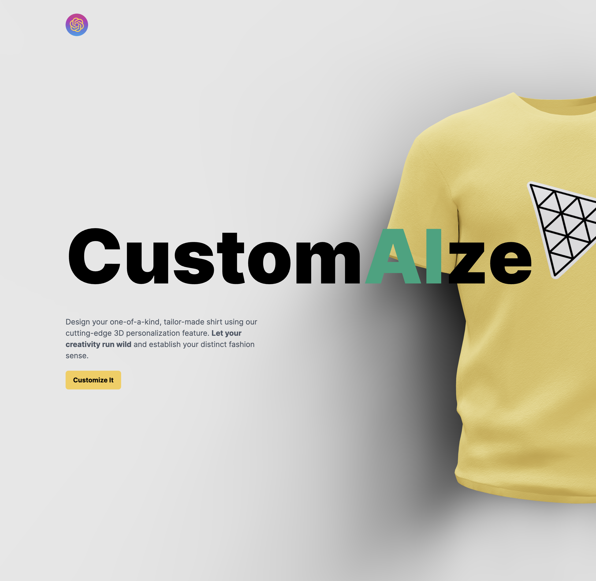

# CustomAIze

CustomAIze is an innovative MERN stack application that combines the power of AI with stunning 3D graphics to revolutionize T-shirt customization. By integrating the DALLE AI API with technologies like ThreeJS, React Three Fiber, TailwindCSS, and Framer Motion, CustomAIze empowers users to unleash their creativity and create personalized T-shirt designs like never before.

📲 [App Demo](https://customaize.vercel.app/)

### Technologies Used:

